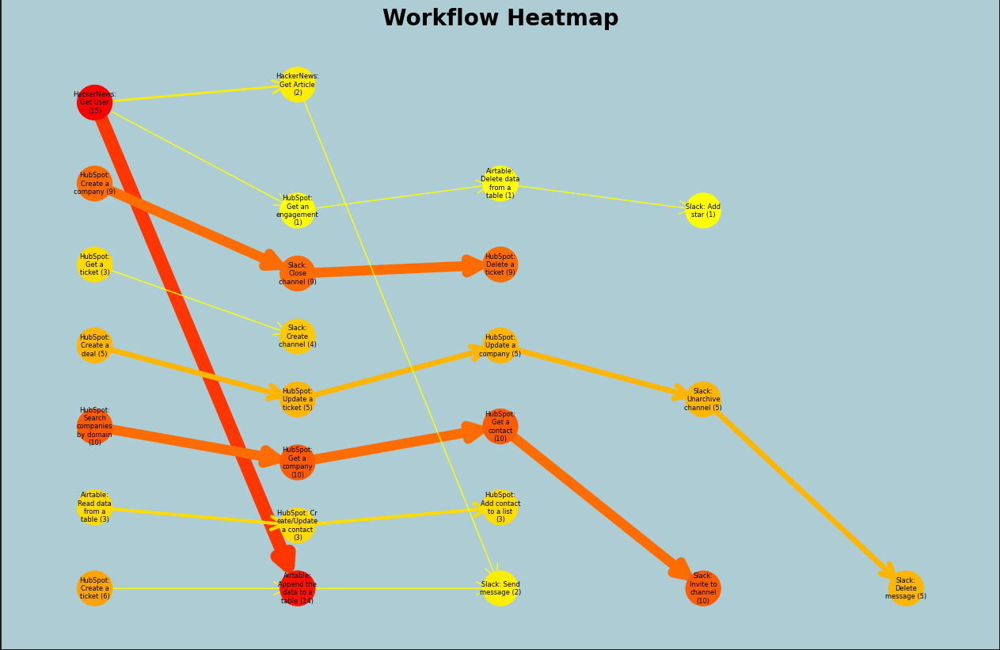

# 🍋 Lemon AI


## About

**Build powerful AI assistants in minutes and execute highly efficient workflow automations by accessing tools like Airtable, Hubspot, Notion, Slack and Github.**

Most connectors available today are focused on read-only operations, limiting the potential of LLMs. Agents, on the other hand, have a tendency to hallucinate from time to time due to missing context or instructions.

With Lemon AI, it is possible to give your agents access to well-defined APIs for more reliable read and write operations. In addition, Lemon AI functions allow you to reduce the risk of hallucinations even more by providing a way to statically define workflows that the model can rely on in case of insecurity.

## 🖲️ Getting Started

### Install the Lemon AI Client

To use Lemon AI in your Python project just run:

```bash
pip install lemonai
```

This will install the corresponding Lemon AI client which you can then import into your script.

The tool uses Python packages `langchain` and `loguru`. In case of any installation errors with Lemon AI, install both packages first and then install the Lemon AI package.

Requires Python 3.8.1 and above.

To use tools that require authentication, you have to store the corresponding access credentials in your environment in the format "{tool name}\_{authentication string}" where the authentication string is one of ["API_KEY", "SECRET_KEY", "SUBSCRIPTION_KEY", "ACCESS_KEY"] for API keys or ["ACCESS_TOKEN", "SECRET_TOKEN"] for authentication tokens. Examples are "OPENAI_API_KEY", "BING_SUBSCRIPTION_KEY", "AIRTABLE_ACCESS_TOKEN".

### Spin Up the Lemon AI Server

The interaction of your agents and all tools provided by Lemon AI is handled by the [Lemon AI Server](https://github.com/felixbrock/lemonai-server). To use Lemon AI you need to run the server on your local machine so the Lemon AI Python client can connect to it.

## Features

### Lemon AI Out-Of-The-Box Workflow Automation

Get started in minutes by giving access to relevant tools and defining a task. Lemon AI handles the rest by finding a combination of relevant tools to solve the given task. Example of retrieving user data from Hackernews and writing it to a table in Airtable:

```python
import os
from lemonai import execute_workflow
from langchain import OpenAI

# Make sure all API keys and access tokens are set in the environment
os.environ["OPENAI_API_KEY"] = "*INSERT OPENAI API KEY HERE*"
os.environ["AIRTABLE_ACCESS_TOKEN"] = "*INSERT AIRTABLE TOKEN HERE*"

hackernews_username = "*INSERT HACKERNEWS USERNAME HERE*"
airtable_base_id = "*INSERT BASE ID HERE*"
airtable_table_id = "*INSERT TABLE ID HERE*"

# Give your instruction to be given to your LLM
prompt = f"""Read information from Hackernews for user {hackernews_username} and then write the results to
Airtable (baseId: {airtable_base_id}, tableId: {airtable_table_id}). Only write the fields "username", "karma"
and "created_at_i". Please make sure that Airtable does NOT automatically convert the field types.
"""

# Initialise your model before passing it into the execute_workflow() function
model = OpenAI(temperature=0)

execute_workflow(llm=model, prompt_string=prompt)
```

It is crucial to ensure the parameters are specified in the prompt otherwise the execution will fail.

### Lemon AI Functions - Solve Tasks Based on Predefined Workflows

Similar to [OpenAI's functions](https://openai.com/blog/function-calling-and-other-api-updates), Lemon AI provides the option to define workflows as reusable functions. Specific workflows can be defined in a separate lemonai.json:

```json
[
  {
    "name": "Hackernews Airtable User Workflow",
    "description": "retrieves user data from Hackernews and appends it to a table in Airtable",
    "tools": ["hackernews-get-user", "airtable-append-data"]
  }
]
```

In addition to Lemon AI's common set of tools, those workflow functions will also be provided to the model. Workflow functions can help to solve tasks in a specific way. This is especially helpful in situations where more deterministic model behavior is needed.

Please make sure to provide a proper workflow 'description' and provide the 'tools' in the right order to allow the correct execution of the workflow '['tool to be used first', ...]'.

Users can ask the LLM to run a specific workflow for them:

```python
import os
from lemonai import execute_workflow
from langchain import OpenAI

# Make sure all API keys and access tokens are set in the environment
os.environ["OPENAI_API_KEY"] = "*INSERT OPENAI API KEY HERE*"
os.environ["AIRTABLE_SECRET_TOKEN"] = "*INSERT AIRTABLE TOKEN HERE*"

hackernews_username = "*INSERT HACKERNEWS USERNAME HERE*"
airtable_base_id = "*INSERT BASE ID HERE*"
airtable_table_id = "*INSERT TABLE ID HERE*"

# Give your instruction to be given to your LLM
prompt = f"""Run the Hackernews Airtable User Workflow for user {hackernews_username}, baseId {airtable_base_id}
and tableId {airtable_table_id}. Only write the fields 'username', 'karma' and 'created_at_i' to the Airtable
table. Please make sure that Airtable does NOT automatically convert the field types."
"""

# Initialise your model before passing it into the execute_workflow() function
model = OpenAI(temperature=0)

execute_workflow(llm=model, prompt_string=prompt)
```

## Traceability

To give full transparency on how your model interacts with Lemon AI tools to solve a given task, all decisions made, tools used and operations performed are written to a local lemonai.log file. Every time your LLM agent is interacting with the Lemon AI tool stack a corresponding log entry is created.

```log
2023-06-26T11:50:27.708785+0100 - b5f91c59-8487-45c2-800a-156eac0c7dae - HackerNews: Get User
2023-06-26T11:50:39.624035+0100 - b5f91c59-8487-45c2-800a-156eac0c7dae - Airtable: Append the data to a table
2023-06-26T11:58:32.925228+0100 - 5efe603c-9898-4143-b99a-55b50007ed9d - HackerNews: Get User
2023-06-26T11:58:43.988788+0100 - 5efe603c-9898-4143-b99a-55b50007ed9d - Airtable: Append the data to a table
```

By using the [Lemon AI Analytics Tool](https://github.com/felixbrock/lemonai-analytics) you can easily gain a better understanding of how frequently and in which workflow combination tools are used. As a result you can identify weak spots in your agent’s decision making capabilities and move to a more deterministic behaviour by defining [Lemon AI functions](#lemon-ai-functions---solve-tasks-based-on-predefined-workflows):



## Supported Tools

Below is a list of all tools supported by Lemon AI and their ids (for use in the lemonai.json workflow file):

### HackerNews

- Get User: hackernews-get-user
- Get Article: hackernews-get-article

### Airtable

- Append data to a table: airtable-append-data
- Delete data from a table: airtable-delete-data
- List all data from a table: airtable-list-data
- Read data from a table: airtable-read-data
- Update data in a table: airtable-update-data

### Slack

- Archive channel: slack-channel-archive
- Close channel: slack-channel-close
- Create channel: slack-channel-create
- Get channel: slack-channel-get
- Get many channels: slack-channel-get-many
- Get channel history: slack-channel-history
- Invite to channel: slack-channel-invite
- Join channel: slack-channel-join
- Kick from channel: slack-channel-kick
- Leave channel: slack-channel-leave
- Get channel members: slack-channel-member
- Open channel: slack-channel-open
- Rename channel: slack-channel-rename
- Reply in channel: slack-channel-reply
- Set channel purpose: slack-channel-set-purpose
- Set channel topic: slack-channel-set-topic
- Unarchive channel: slack-channel-unarchive
- Get file: slack-file-get
- Get many files: slack-file-get-many
- Delete message: slack-message-delete
- Get message permalink: slack-message-get-permalink
- Search for message: slack-message-search
- Send message: slack-message-send
- Update message: slack-message-update
- Add message reaction: slack-reaction-add
- Get message reaction: slack-reaction-get
- Remove message reaction: slack-reaction-remove
- Add star: slack-star-add
- Delete star: slack-star-delete
- Get many stars: slack-star-get-many
- Get user: slack-user-get
- Get many users: slack-user-get-many
- Get user's status: slack-user-get-status
- Update user's profile: slack-user-update-profile
- Create user group: slack-user-group-create
- Disable user group: slack-user-group-disable
- Enable user group: slack-user-group-enable
- Get many user groups: slack-user-group-get-many
- Update user group: slack-user-group-update

### HubSpot

- Create/Update a contact: hubspot-create-update-contact
- Delete a contact: hubspot-delete-contact
- Get a contact: hubspot-get-contact
- Get all contacts: hubspot-get-all-contacts
- Get recently created/updated contacts: hubspot-get-recently-created-updated-contacts
- Search contacts: hubspot-search-contacts
- Add contact to a list: hubspot-add-contact-to-list
- Remove a contact from a list: hubspot-remove-contact-from-list
- Create a company: hubspot-create-company
- Delete a company: hubspot-delete-company
- Get a company: hubspot-get-company
- Get all companies: hubspot-get-all-companies
- Get recently created companies: hubspot-get-recently-created-updated-companies
- Search companies by domain: hubspot-search-companies-by-domain
- Update a company: hubspot-update-company
- Create a deal: hubspot-create-deal
- Delete a deal: hubspot-delete-deal
- Get a deal: hubspot-get-deal
- Get all deals: hubspot-get-all-deals
- Get recently created deals: hubspot-get-recently-created-updated-deals
- Search deals: hubspot-search-deals
- Update a deal: hubspot-update-deal
- Create an engagement: hubspot-create-an-engagement
- Delete an engagement: hubspot-delete-an-engagement
- Get an engagement: hubspot-get-an-engagement
- Get all engagements: hubspot-get-all-engagements
- Get all fields from a form: hubspot-get-fields-form
- Create a ticket: hubspot-create-ticket
- Delete a ticket: hubspot-delete-ticket
- Get a ticket: hubspot-get-ticket
- Get all tickets: hubspot-get-all-tickets
- Update a ticket: hubspot-update-ticket

### Github

- Create a new file in repository: github-file-create
- Delete a file in repository: github-file-delete
- Edit a file in repository: github-file-edit
- Get the data of a single file: github-file-get
- Create a new issue: github-issue-create
- Create a new comment on an issue: github-issue-comment
- Edit an issue: github-issue-edit
- Get the data of a single issue: github-issue-get
- Lock an issue: github-issue-lock
- Get the data of a single repository: github-repo-get
- Return the contents of the repository's license file, if one is detected: github-repo-license
- Return issues of a repository: github-repo-issues
- Get the top 10 popular content paths over the last 14 days: github-repo-top-paths
- Get the top 10 referring domains over the last 14 days: github-repo-top-domains
- Create a new release: github-release-create
- Get a release: github-release-get
- Get all repository releases: github-release-get-all
- Delete a release: github-release-delete
- Update a release: github-release-update
- Create a new review: github-review-create
- Get a review for a pull request: github-review-get
- Get all reviews for a pull request: github-review-get-all
- Update a review: github-review-update
- Return the repositories of a user: github-user-repos
- Invite a user to an organisation: github-user-org-invite
- Return the repositories of an organisation: github-org-repos-get

### Notion

- Append block child: notion-append-after-block
- Get block children: notion-get-child-blocks
- Get database: notion-get-database
- Get all databases: notion-get-many-database
- Search database: notion-search-database
- Create database page: notion-create-database-page
- Get database page: notion-get-database-page
- Get all database pages: notion-get-many-database-page
- Update database page: notion-update-database-page
- Archive page: notion-archive-page
- Create page: notion-create-page
- Search page: notion-search-page
- Get user: notion-get-user
- Get all users: notion-get-many-user


## ❤️‍🔥 Next Up

- [x] Github
- [x] Notion
- [ ] Gmail
- [ ] Google Calendar
- [ ] Kafka
- [ ] Pipedrive
- [ ] Monday.com
- [ ] Stripe
- [ ] Medium
- [ ] Discord
- [ ] Google Cloud Realtime Database
- [ ] Salesforce


## Contributing

Do you have a connector you want to see included in Lemon AI or do you want to contribute in any other way? That's amazing 🥳 Just reach out, we are extremely open to contributions!
