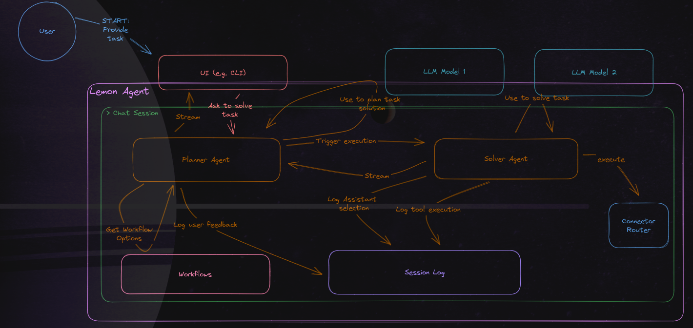
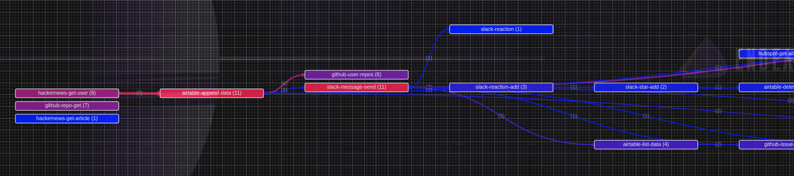

<div align="center">
  <h1>🍋 Lemon Agent</h1>
  <h3>When life gives you lemons, automate it using Lemon Agent 😎</h3>
  <a href="https://discord.gg/fWU4rDYSxw">

  </a>
  <a href="https://twitter.com/getlemonai">
    
  </a>
  <a href="https://github.com/trpc/trpc/blob/main/LICENSE">
    
  </a>
  <br />
    <a href="https://python.langchain.com/docs/integrations/tools/lemon-agent">
    
  </a>
  <br />
  <br />
</div>

https://github.com/felixbrock/lemon-agent/assets/70200999/fc829e7a-0827-45e9-9ecf-13d47f6ff819

**Start talking to your [tools](#🧩-supported-tools) like Airtable, Hubspot, Discord, Notion and GitHub in minutes and build powerful workflow automations by enabling your LLM to reliably perform read and write operations.**

Lemon Agent is a standalone supervised Plan and Solve Agent _(ACL 2023 Paper "[Plan-and-Solve Prompting: Improving Zero-Shot Chain-of-Thought Reasoning by Large Language Models](https://arxiv.org/abs/2305.04091)")_ that allows for

🤝 **Separation of tasks and human-in-the-loop interactions**

> Lemon Agent is currently holding a Planner Agent and a Solver Agent to keep the agents focussed and increase accuracy. We are planning on adding additional agents real soon. In addition, Lemon Agent will ask for approval at relevant workflow steps to make sure the intended actions are executed.

🌌 **Unlimited configuration options**

> Lemon Agent gives you unlimited configuration options (see example here) when defining your workflow. For instance, you can tell Lemon Agent to ask for permission before executing a workflow step or to drop a 🧔‍♀️ dad joke every time the model executes a workflow step.

👀 **UI flexibility**

> Build any UI on top or engage with Lemon Agent via the built-in CLI.

🎨 **[Soon] Model & framework agnostic operations**

> Lemon Agent is a standalone agent, but can easily be integrated into frameworks like LangChain and be used with any model.

**Bonus:** Get a detailed understanding of how Lemon Agent interacts with your tools in each step using the [analytics visualization](#5-gain-transparency-on-your-agents-decision-making) (**.html file that can be run without any additional installation**)!

<div align="center">
<figure>
    
  </figure>
</div>

## 🏗️ Architecture

A Lemon Agent session is initiated by the user. Via the UI the user then directly chats with the planner agent to define how to solve a given task. Once a solution was defined, the planner agent then starts communicating with the execution agent, which, finally, executes a given workflow step by making use of the multiple tools that are available to the Lemon Agent.



## ⚡️ Getting Started

### 1. Prerequisites

- Node.js 18.x or above.
- [pnpm](https://pnpm.io/installation)
- If you are following this example an OpenAI API key and a [GitHub personal access token](https://pnpm.io/installation) are required

### 2. Installing

1. To run the Lemon Agent locally `git clone` this repo.
2. Open the local clone with your favourite IDE and run `pnpm i` at the root of the project.

### 3. Start the Lemon Agent

1. At the root of the project run `cp .env.example .env.development` to create a new env file.
2. Store your OpenAI (as _AUTH_TOKEN_OPENAI_) and GitHub (as _AUTH_TOKEN_GITHUB_) auth token in _.env.development_.
3. At the root of the project run `pnpm dlx turbo dev` to start the Lemon Agent. In case this doesn't work for you run `pnpm dlx turbo build` at the root, run `cd apps/cli` to navigate to the project's cli client, and finally, run `pnpm run dev`.

By now your Lemon Agent should be running and waiting for a task to solve.

### 4. A simple example

Similar to [OpenAI functions](https://openai.com/blog/function-calling-and-other-api-updates), the Lemon Agent provides the option to define workflows as reusable functions. Feel free to define and configure any workflow you want in `data/workflow.json`. Include different [tools](https://github.com/felixbrock/lemon-agent/blob/main/docs/tools.md) and add additional fields to further configure the workflow. For instance, the `userPermissionRequired` field is interpreted by the model as a pre-execution condition to ask the user whether to execute a workflow step.

**Example Workflow**

```Json
{
  "steps": [
    {
      "toolId": "github-repo-get",
      "userPermissionRequired": false
    }
  ]
}
```

To run the workflow above all you have to do is to tell the Lemon Agent to _'get information about a repository'_ and finally approve _'yes, do this for the repository lemon-agent and the owner felixbrock'_.

### 5. Gain transparency on your Agent's decision making

To gain transparency on how your Agent interacts with Lemon AI tools to solve a given task, all decisions made, tools used and operations performed are written to a local `execution.log` file. Every time your LLM agent is interacting with the Lemon AI tool stack a corresponding log entry is created:

```log
2023-06-26T11:50:27.708785+0100 - b5f91c59-8487-45c2-800a-156eac0c7dae - hackernews-get-user
2023-06-26T11:50:39.624035+0100 - b5f91c59-8487-45c2-800a-156eac0c7dae - airtable-append-data
2023-06-26T11:58:32.925228+0100 - 5efe603c-9898-4143-b99a-55b50007ed9d - hackernews-get-user
2023-06-26T11:58:43.988788+0100 - 5efe603c-9898-4143-b99a-55b50007ed9d - airtable-append-data
```

By using the analytics visualization you can easily gain a better understanding of how frequently and in which order tools are used. As a result, you can identify weak spots in your agent’s decision-making capabilities and move to a more deterministic behavior by further configuring your Lemon Agent workflows.



## 🧩 Supported Tools

We already allow agents to interact with over [120 tools](https://github.com/felixbrock/lemon-agent/blob/main/docs/tools.md) across the following services:

- HackerNews
- Airtable
- Slack
- HubSpot
- Github
- Notion
- Discord
- Medium
- Monday.com

## 🩻 Next Up

- [x] Github
- [x] Notion
- [x] Discord
- [x] Medium
- [x] Monday.com
- [ ] Gmail
- [ ] Google Calendar
- [ ] Kafka
- [ ] Pipedrive
- [ ] Stripe
- [ ] Google Cloud Realtime Database
- [ ] Salesforce

## 🦸 Contributing

Great to see you here! We are extremely open to contributions! You can find more information in our [CONTRIBUTING.md](https://github.com/felixbrock/lemon-agent/blob/main/.github/CONTRIBUTING.md). If you have any more questions feel free to drop us a message on <a href="https://discord.gg/bsgzjEpw">Discord</a>.

## ❤️‍🔥 Contributors

> Those are the team members and people who actively help out improving the codebase by making PRs and reviewing code. We are beyond grateful for your help!

<table cellspacing="0" cellpadding="0" style="border:none;">
  <tbody>
    <tr style="border:none;">
      <td align="center" style="border:none;"><a href="https://twitter.com/felixbrockm"><br /><sub><b>Felix Brockmeier</b></sub></a></td>
      <td align="center" style="border:none;"><a href="https://www.linkedin.com/in/mohammed-abdus-samad-hannan-3a2687202/"><br /><sub><b>Mohammed Hannan</b></sub></a></td>
      <td align="center" style="border:none;"><a href="https://www.linkedin.com/in/haiphunghiem/"><br /><sub><b>Hai Nghiem</b></sub></a></td>
      <td align="center" style="border:none;"><a href="https://twitter.com/schroeerclemens"><br /><sub><b>Clemens Schroeer</b></sub></a></td>
    </tr>
  </tbody>
</table>
